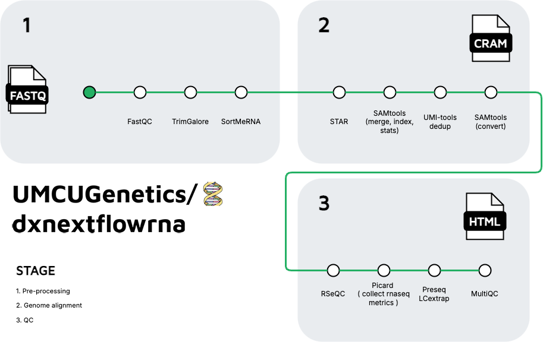

<h1>
  <picture>
    <source media="(prefers-color-scheme: dark)" srcset="docs/images/umcugenetics-dxnextflowrna_logo_dark.png">
    
  </picture>
</h1>

[](https://github.com/umcugenetics/dxnextflowrna/actions/workflows/ci.yml)
[](https://github.com/umcugenetics/dxnextflowrna/actions/workflows/linting.yml)[](https://nf-co.re/dxnextflowrna/results)[](https://doi.org/10.5281/zenodo.XXXXXXX)
[](https://www.nf-test.com)

[](https://www.nextflow.io/)
[](https://docs.conda.io/en/latest/)
[](https://www.docker.com/)
[](https://sylabs.io/docs/)
[](https://cloud.seqera.io/launch?pipeline=https://github.com/umcugenetics/dxnextflowrna)

[](https://nfcore.slack.com/channels/dxnextflowrna)[](https://twitter.com/nf_core)[](https://mstdn.science/@nf_core)[](https://www.youtube.com/c/nf-core)

## Introduction

**umcugenetics/dxnextflowrna** is a bioinformatics pipeline that can be used to analyse human RNA sequencing data.
It takes FASTQ files as input,
performs quality control (QC), trimming, filtering and alignment,
and produces an extensive QC report.



1. Read QC ([`FastQC`](https://www.bioinformatics.babraham.ac.uk/projects/fastqc/))
2. Present QC for raw reads ([`MultiQC`](http://multiqc.info/))
3. Adapter and quality trimming ([`Trim Galore!`](https://www.bioinformatics.babraham.ac.uk/projects/trim_galore/))
4. Removal of ribosomal RNA ([`SortMeRNA`](https://github.com/biocore/sortmerna))
5. Alignment ([`STAR`](https://github.com/alexdobin/STAR))
6. Merge, sort and index alignments ([`SAMtools`](https://sourceforge.net/projects/samtools/files/samtools/))
7. UMI-based deduplication ([`UMI-tools`](https://github.com/CGATOxford/UMI-tools))
8. Convert to CRAM ([`SAMtools`](https://sourceforge.net/projects/samtools/files/samtools/))
9.  Extensive quality control:
    1. [`RSeQC`](http://rseqc.sourceforge.net/)
    2. [`Preseq`](http://smithlabresearch.org/software/preseq/)
10. Present QC ([`MultiQC`](http://multiqc.info/))


## Usage

> [!NOTE]
> If you are new to Nextflow and nf-core, please refer to [this page](https://nf-co.re/docs/usage/installation) on how to set-up Nextflow. Make sure to [test your setup](https://nf-co.re/docs/usage/introduction#how-to-run-a-pipeline) with `-profile test` before running the workflow on actual data.

1. Create an input directory with sample's fastq files (paired, multiple lanes allowed.)
2. Clone the github repository and all dependencies if required.
3. Install
```bash
sh install.sh
```
4. Now, you can run the pipeline using:

```bash
<path_to_git_clone>/tools/nextflow/nextflow run \
<path_to_git_clone>/main.nf  \
-c <path_to_git_clone>/nextflow.config \
--input <input> \
--outdir <output> \
--analysis_id <analysis_id> \
--email <email> \
-resume \
-ansi-log false \
-profile singularity \
```

> [!WARNING]
> Please provide pipeline parameters via the CLI or Nextflow `-params-file` option. Custom config files including those provided by the `-c` Nextflow option can be used to provide any configuration _**except for parameters**_; see [docs](https://nf-co.re/docs/usage/getting_started/configuration#custom-configuration-files).

For more details and further functionality, please refer to the [usage documentation](docs/usage.md)

## Pipeline output

For more details about the output files and reports, please refer to the
[output documentation](docs/output.md).

## Developers: Instructions and reminders when changing DxNextflowRNA
> [!WARNING]
> Please, try to keep using nfcore tools and guidelines!

### Update files
- Update all type of citations:
  - [`CITATIONS.md`](CITATIONS.md) file.
  - toolCitationText and toolBibliographyText in [`utils_umcugenetics_dxnextflowrna_pipeline/main.nf`](./subworkflows/local/utils_umcugenetics_dxnextflowrna_pipeline/main.nf)
- Update version in [`nextflow.config`](nextflow.config) and [`multiqc_config`](assets/multiqc_config.yml) by using `nf-core pipelines bump-version <new_version>`
- Update [`metro map`](./docs/images/umcugenetics-dxnextflowrna_metro_map.png)

### When updating Nextflow
- Update version by using `nf-core pipelines bump-version --nextflow <new_nextflow_version>`
- Update version in [`install.sh`](./install.sh) and
    ```bash
    sh install.sh
    ```


## Credits

umcugenetics/dxnextflowrna was originally written by UMCU Genetics.

<!-- We thank the following people for their extensive assistance in the development of this pipeline: -->

<!-- TODO nf-core: If applicable, make list of people who have also contributed -->


## Citations

<!-- TODO nf-core: Add citation for pipeline after first release. Uncomment lines below and update Zenodo doi and badge at the top of this file. -->
<!-- If you use umcugenetics/dxnextflowrna for your analysis, please cite it using the following doi: [10.5281/zenodo.XXXXXX](https://doi.org/10.5281/zenodo.XXXXXX) -->

An extensive list of references for the tools used by the pipeline can be found in the [`CITATIONS.md`](CITATIONS.md) file.

You can cite the `nf-core` publication as follows:

> **The nf-core framework for community-curated bioinformatics pipelines.**
>
> Philip Ewels, Alexander Peltzer, Sven Fillinger, Harshil Patel, Johannes Alneberg, Andreas Wilm, Maxime Ulysse Garcia, Paolo Di Tommaso & Sven Nahnsen.
>
> _Nat Biotechnol._ 2020 Feb 13. doi: [10.1038/s41587-020-0439-x](https://dx.doi.org/10.1038/s41587-020-0439-x).
